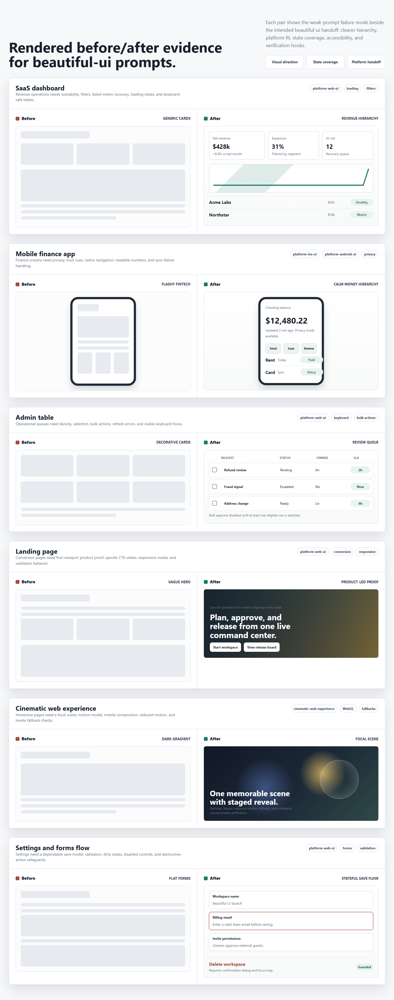

# Example Gallery

[Open the rendered gallery](rendered-gallery.html) to inspect the browser-rendered before/after evidence page. The screenshot above is captured from that page and can be regenerated with Playwright.

Run `powershell -ExecutionPolicy Bypass -File scripts/verify-rendered-gallery.ps1` from the repository root to check that the gallery loads, screenshots are nonblank, example links resolve, and desktop/mobile layouts avoid horizontal overflow.

The gallery is intentionally prompt-led in v0.1. Each example shows how a weak prompt becomes a stronger design handoff, then names the evidence to capture when comparing outputs.

For now, "before" means the weak prompt and its likely failure mode. "After" means the Beautiful UI prompt, expected handoff, rendered gallery case, and evidence checklist. Future gallery versions should add per-example screenshot sets and agent evals comparing outputs with and without the skill.

| Example | Weak prompt problem | Skill outcome | Evidence to capture |
| --- | --- | --- | --- |
| [SaaS dashboard](../examples/saas-dashboard.md) | Generic cards and charts | Revenue-focused hierarchy, filters, responsive states | Dashboard hierarchy, filter states, table/chart loading and errors |
| [Mobile finance app](../examples/mobile-finance-app.md) | Flashy fintech surface | Trust-focused native mobile flow | Privacy mode, sync/error states, iOS and Android adaptation |
| [Admin table](../examples/admin-table.md) | Decorative redesign | Dense, keyboard-friendly review queue | Row density, keyboard focus, selection and bulk-action states |
| [Landing page](../examples/landing-page.md) | Vague hero and card pile | Product-led conversion hierarchy | First-viewport product proof, CTA states, responsive mobile layout |
| [Cinematic web experience](../examples/cinematic-web-experience.md) | Cool website with no art direction | Cinematic focal scene, technology ladder choice, motion model, fallbacks | Desktop/mobile screenshots, nonblank canvas/media check, reduced-motion fallback |
| [Settings forms flow](../examples/settings-forms-flow.md) | Flat forms | Clear save, validation, and destructive-action states | Dirty/saved/error states, validation copy, dialog focus behavior |

Each linked example keeps the validator-required sections: `## Before Prompt`, `## Beautiful UI Prompt`, and `## Expected Handoff`.

For cinematic reference recreation, use [Claude Cinematic Web Recipe](../recipes/claude-cinematic-web.md).
